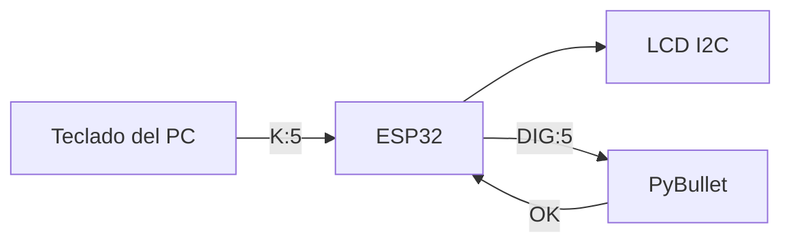
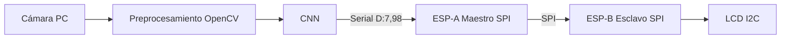

# Actividad 6 – ESP32, visión computacional y simulación robótica

**Autor:** Bryan Andrey Martínez Montaño
**Programa:** Ingeniería Mecatrónica – Universidad Militar Nueva Granada
**Asignatura:** Microcontroladores

Integración de una ESP32 con un PC para dos tareas:

1. **Punto 1:** teclado + LCD I2C + brazo robótico simulado en PyBullet que dibuja el dígito seleccionado.
2. **Punto 2:** reconocimiento de dígitos escritos a mano con OpenCV y una red neuronal convolucional (CNN), enviados a la ESP32 y mostrados en una LCD mediante comunicación SPI.

---

## Videos de funcionamiento

| Punto 1 – Brazo robótico dibujante | Punto 2 – Reconocimiento de dígitos + SPI |
|---|---|
| [](https://youtu.be/VoNTEAlpFmY) | [](https://youtu.be/ZploZIv5ejw) |

---

## Estructura del repositorio

```
├── README.md
├── punto1/
│   ├── brazo_dibujante.py      # PC: simulación PyBullet + captura de teclado
│   ├── brazo.urdf              # modelo del brazo (base del repositorio U_Militar)
│   └── esp32/main.py           # ESP32 (MicroPython): lógica del teclado + LCD
└── punto2/
    ├── entrenar_cnn.py         # PC: entrenamiento de la CNN (se ejecuta una vez)
    ├── reconocer_digitos.py    # PC: cámara + OpenCV + CNN + envío serial
    └── esp32/main.py           # ESP32 (MicroPython): maestro y esclavo SPI + LCD
```

---

## Requisitos

**PC (Python 3.10 – 3.12):**

```bash
pip install pybullet pyserial numpy opencv-python tensorflow
```

**ESP32:** firmware MicroPython. Los archivos `main.py` se cargan con Thonny y no requieren librerías externas, ya que el driver de la LCD está incluido.

**Hardware:** ESP32, LCD 16x2 con módulo I2C (PCF8574) y cable puente.

### Conexión de la LCD (ambos puntos)

| LCD I2C | ESP32 |
|---|---|
| GND | GND |
| VCC | VIN (5 V) |
| SDA | GPIO21 |
| SCL | GPIO22 |

> Si la LCD no muestra texto, ajustar el potenciómetro de contraste del módulo. La dirección I2C suele ser `0x27` o `0x3F`.

---

## Punto 1 – Teclado I2C + brazo robótico en PyBullet



Como no se contaba con un teclado matricial físico, se **virtualizó el teclado 4x4**. El PC captura las teclas y se las envía a la ESP32, que ejecuta la misma lógica que tendría con el teclado real: selecciona el dígito, lo muestra en la LCD y ordena el dibujo. El brazo resuelve la **cinemática inversa** en cada punto del trazo y dibuja el número sobre una pizarra virtual.

| Tecla PC | Equivale a | Acción |
|---|---|---|
| `0`–`9` | 0–9 | Seleccionar dígito |
| `Enter` / `#` | # | Enviar y dibujar |
| `Borrar` / `*` | * | Borrar selección |
| `H` | A | Brazo a posición HOME |
| `C` | C | Limpiar pizarra |

**Ejecución:**

```bash
python brazo_dibujante.py --puerto COM3 --urdf brazo.urdf
```

Si no se indica un URDF, el script genera un brazo de ejemplo de 3 GDL. Sin la ESP32 conectada, funciona en modo prueba.

---

## Punto 2 – Reconocimiento de dígitos con OpenCV + CNN + SPI



### Aclaración sobre la arquitectura maestro–esclavo

El enunciado plantea dos ESP32 (maestro y esclavo) y una pantalla OLED. En esta implementación se hicieron dos adaptaciones:

- **Una sola ESP32 simula ambos roles.** El código está dividido en dos clases, `Maestro` (ESP-A) y `Esclavo` (ESP-B). La comunicación entre ellas usa el **periférico SPI por hardware real** (SPI modo 0, 100 kHz, MSB primero, con línea CS) en configuración **loopback**: un cable puente une **GPIO23 (MOSI)** con **GPIO19 (MISO)**. Lo que el maestro transmite viaja físicamente por el bus y el esclavo lo lee de MISO. Si se retira el puente, el esclavo reporta "Error de trama", lo que demuestra que los datos pasan por el cable.
- **LCD 16x2 I2C en lugar de OLED.** Se usó la misma LCD del punto 1.

> Nota técnica: MicroPython no incluye modo esclavo SPI. Con dos placas reales, el esclavo tendría que leer el bus por software o programarse en C++ con el driver `spi_slave` de ESP-IDF.

**Trama SPI (4 bytes):**

| Byte | Contenido |
|---|---|
| 0 | Cabecera `0xAA` |
| 1 | Dígito (0–9) |
| 2 | Confianza (%) |
| 3 | Checksum = `0xAA ^ dígito ^ confianza` |

**Conexiones adicionales:** puente GPIO23 → GPIO19. SCK = GPIO18 y CS = GPIO5 se generan normalmente.
⚠️ No usar GPIO6–GPIO11, porque están conectados a la memoria flash de la ESP32.

### Entrenamiento de la CNN (necesario antes de usar el reconocimiento)

El reconocimiento **no funciona sin un modelo entrenado**. El script `entrenar_cnn.py` se ejecuta **una sola vez**, necesita internet la primera vez para descargar el dataset y genera el archivo `modelo_digitos.keras`:

```bash
python entrenar_cnn.py
```

- **Dataset:** MNIST, con 60 000 imágenes de entrenamiento y 10 000 de prueba de dígitos manuscritos de 28x28 px.
- **Arquitectura:** Conv2D(32) → MaxPool → Conv2D(64) → MaxPool → Flatten → Dropout(0.3) → Dense(128) → Dense(10, softmax).
- **Aumento de datos:** rotación, zoom y traslación aleatorios, para tolerar las variaciones de la cámara.
- **Entrenamiento:** 8 épocas, optimizador Adam. Alcanza típicamente alrededor de 99 % de exactitud en el conjunto de prueba de MNIST.

Para que la imagen de la cámara se parezca a MNIST, el preprocesamiento hace lo siguiente: escala de grises, desenfoque gaussiano, umbral adaptativo invertido (trazo blanco sobre fondo negro), apertura y dilatación morfológica, recorte del dígito, escalado a 20x20, relleno a 28x28 y centrado por centro de masa.

### Ejecución

```bash
python reconocer_digitos.py --puerto COM3
```

Se escribe el número con marcador grueso en papel blanco y se ubica dentro del recuadro verde. El dígito se envía automáticamente cuando la predicción se mantiene estable con más de 85 % de confianza, o manualmente con `Espacio`. Con `q` se sale.

---

## Posibles usos

- **Robótica educativa:** robots que escriben o dibujan a partir de órdenes numéricas, y prácticas de cinemática inversa.
- **Interfaces hombre–máquina:** ingresar códigos, pisos de un ascensor o cantidades escribiendo a mano frente a una cámara.
- **Automatización industrial:** lectura de números en etiquetas, formularios o displays analógicos, con visualización en un tablero embebido.
- **Clasificación y logística:** leer números de lote o casillero para dirigir un actuador (banda, brazo o compuerta).
- **Sistemas distribuidos con SPI:** un PC o microcontrolador principal procesa la visión y delega la visualización o el control a nodos esclavos.
- **Accesibilidad:** entrada de datos sin teclado físico.

---

## Autor

Bryan Andrey Martínez Montaño – Ingeniería Mecatrónica, UMNG
